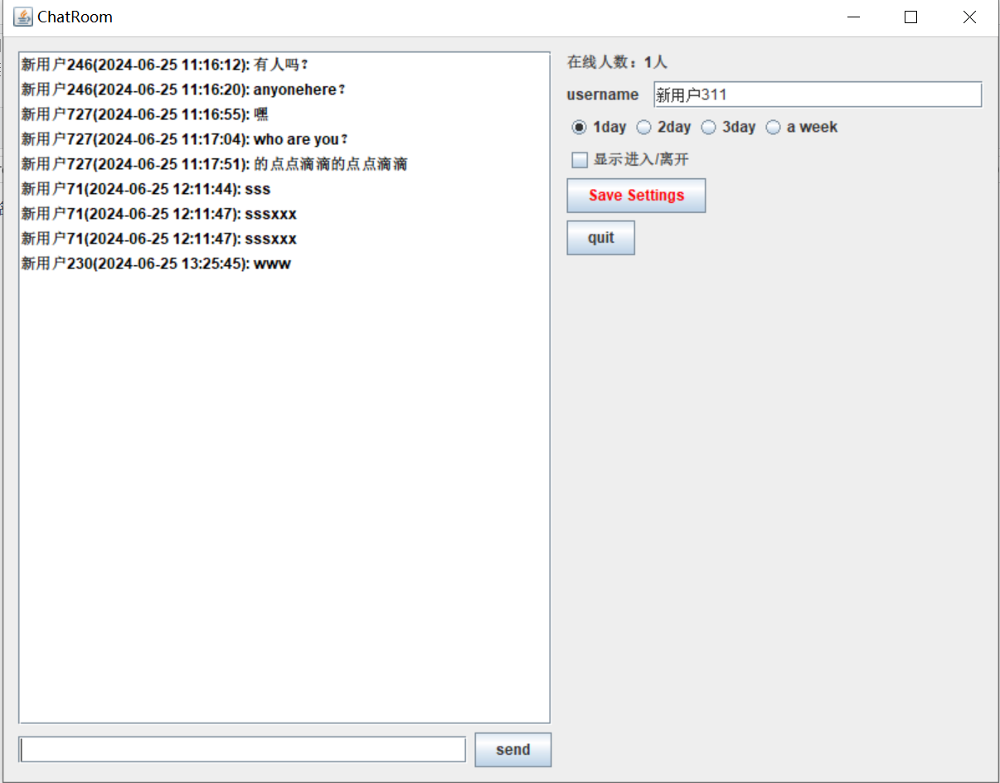

# ToChat
实现了一个简易的聊天室，截图如下：

项目分为服务端和客户端，服务端部署在云服务器，可通过客户端连接。
为了加强对底层Socket通信的理解以及模拟网络协议，采用Java原生的Socket API进行网络通信。
并没有采取常用的servelet容器比如tomcat以及web框架spring mvc。
客户端采用Swing制作了一个简单的界面，并打包成exe文件。
服务端采用springboot框架管理第三方依赖及打包，用ServerSocket监听客户端的网络请求。
一些重要的点：

# 1、服务端、客户端如何通信。
服务端用一个ServerSocket监听，将新连接的socket放入队列socketList，
同时开启一个新线程ServerThread , 将socket当做参数传入，获取socket的输入输出流，
在while循环中阻塞读取客户端从输入流传来的请求，根据报文内容，通过输出流进行响应。
比如客户端发来的进入/离开房间以及聊天报文，经解析后会进行广播，遍历socketList，广播给所有未关闭的客户端。

# 2、报文格式
例如发送消息的报文，如下：  
GHW&Message&新用户22&2024-06-25 13:25：45&大家好啊
有五个字段，用&分隔，固定以GHW开头，第二个字段为报文类型，Message代表发送信息，
除此之外还有Enter，Quit，Data，Ask。第三个字段为用户名字，第四个字段为时间，第五个为具体数据。
在服务端和客户端都创建了一个工具类ProxyUtil用来封装信息，调用它的make方法即可构造报文。

# 3、客户端非正常退出
正常情况下客户端点击quit按钮退出，会发送给服务端报文，服务端关闭此socket连接。
但是如果用户非正常退出，服务端与此客户端连接的socket仍未关闭，而广播消息时会尝试对此socket发送报文，抛出异常。
解决方案：用try-catch捕获，并关闭此socket。

# 4、线程安全
socketList在主线程中进行写（添加新socket）,在多个serverThread线程中进行读（广播，遍历存活的socket）。
在不同线程中读写存在线程安全问题。由于读多写少，采用读写锁的解决方案。在server中新增静态变量ReentrantreadwriteLock，
以及对应的readlock和writelock。在读/写之前加上读/写锁，并在结束时释放。
还存在一个问题：需要定时清理socketList中关闭的socket，但是在关闭socket时从socketList中删除需要加写锁，大大降低效率。
解决方案：利用Spring框架中的SpringTask定时任务类，定时扫描socketList中关闭的socket并删除，同样需要加上写锁。
顺带也实现了统计在线人数的功能：在扫描时记录存活的socket数量，并广播给存活的客户端，在客户端中显示在线人数。

# 5、离线消息
服务端能根据客户端发来的聊天消息广播给所有存活的客户端，但这只是在线聊天。
要实现离线聊天，服务端在接收客户端的聊天消息时应把此条消息存到数据库中。
同时，客户端发送给服务端获取消息记录的Ask请求，服务端查询数据库获取消息列表，通过单播发送给客户端。
由于采用sporingboot框架，用mabatis进行数据库编写十分简单，引入mybatis的starter包并在配置文件中配置mysql的数据源信息即可。
再创建一个mapper层接口，mybatis会创建这个接口的代理类，而spring会将这个代理类交给容器管理。
那如何在serverThread中自动注入这个代理类呢？
将serverThread也作为bean注入是不妥的，它是多例，并且有一个成员对象socket。
合适的做法是在server中获取到applicationcontext容器，在创建serverThread实例时手动将代理类注入。
这样一来就可以在serverThread中调用代理类的方法操作数据库，获取历史消息。
同时在客户端可以指定历史消息的天数以及是否显示进入/离开房间的消息，通过Ask报文的text字段实现。

# 6、消息队列
在定时任务中服务端向客户端发送报文，同时服务端会响应用户端的请求，发送报文。
但是同一时间，只能有一个线程获取到输入流发送报文。
如果对每个线程的outputstream都上锁，会大大降低效率，每次广播都将花费大量时间。
解决方法：消息队列。在定时任务和广播、单播中并不直接获取outputstream发送，而是将
报文和socket封装为一个消息，存储到消息队列中。
消息队列在server中定义为精静态变量，且由线程安全的LinkedBlockingQueue实现。
并且server再开一个线程，不断从消息队列中take消息进行发送。
